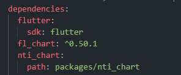

# NTI CHART

✨ NTI CHART adalah package flutter yang digunakan untuk membuat chart-chart terinspirasi dari [Dashoard Ninja Odoo](https://apps.odoo.com/apps/modules/13.0/ks_dashboard_ninja/). Library ini dibuat untuk mempermudah proses pembuatan chart yang umum digunakan pada ERP - MOBILE. Dengan pembuatan library ini, developer tidak perlu lagi melakukan copy-paste code secara manual ✨ 

## How To Use 

1. Buat folder baru dengan nama folder `packages` pada root folder project flutter.
2. Clone repository ini pada folder `packages` yang dibuat pada step 1. Clone package sebagai submodel dengan command berikut
    ```sh
    git submodule add <link_repo_package>
    ```
3. Tambahkan package nti_chart pada `pubspec.yaml` seperti gambar dibawah



### Chart Type
| Chart | Preview | Example |  Documentation | 
| ------ | ------ | ------ |  ------ |
| Stats Card |  | [Example Here]() | [Doc Here]() | 
| Bar Chart |  | [Example Here]() | [Doc Here]() |
|  |
